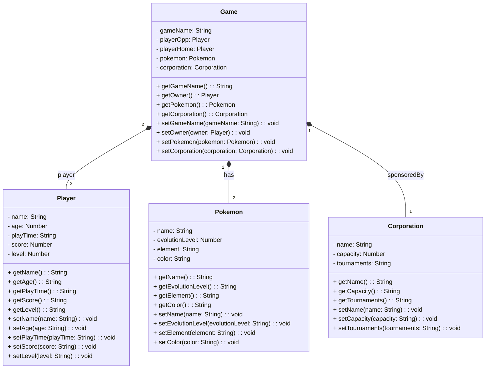

#API REST
##Diagrama de Classes

```mermaid
classDiagram
  class Game {
    - gameName: String
    - playerOpp: Player
    - playerHome: Player
    - pokemon: Pokemon
    - corporation: Corporation
    + getGameName(): String
    + getOwner(): Player
    + getPokemon(): Pokemon
    + getCorporation(): Corporation
    + setGameName(gameName: String): void
    + setOwner(owner: Player): void
    + setPokemon(pokemon: Pokemon): void
    + setCorporation(corporation: Corporation): void
  }

  class Player {
    - name: String
    - age: Number
    - playTime: String
    - score: Number
    - level: Number
    + getName(): String
    + getAge(): String
    + getPlayTime(): String
    + getScore(): String
    + getLevel(): String
    + setName(name: String): void
    + setAge(age: String): void
    + setPlayTime(playTime: String): void
    + setScore(score: String): void
    + setLevel(level: String): void
  }

  class Pokemon {
    - name: String
    - evolutionLevel: Number
    - element: String
    - color: String
    + getName(): String
    + getEvolutionLevel(): String
    + getElement(): String
    + getColor(): String
    + setName(name: String): void
    + setEvolutionLevel(evolutionLevel: String): void
    + setElement(element: String): void
    + setColor(color: String): void
  }

  class Corporation {
    - name: String
    - capacity: Number
    - tournaments: String
    + getName(): String
    + getCapacity(): String
    + getTournaments(): String
    + setName(name: String): void
    + setCapacity(capacity: String): void
    + setTournaments(tournaments: String): void
  }

  Game "2" *-- "2" Player : player
  Game "2" *-- "2" Pokemon : has
  Game "1" *-- "1" Corporation : sponsoredBy
```
